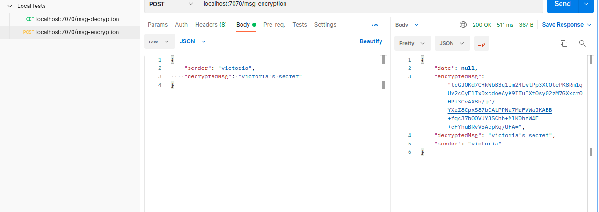
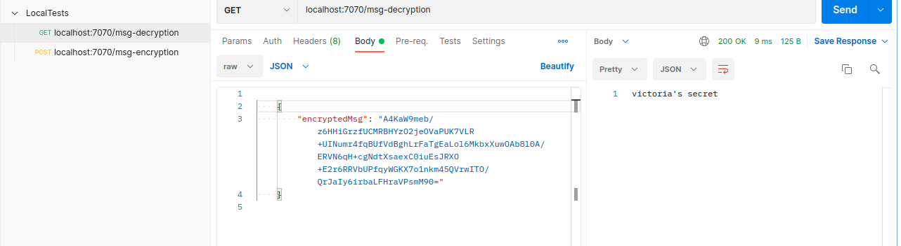

JAVALIN TEST APPLICATION 

- This application was created with the soul purpose of testing Javalin and encrypting/decrypting messages using RSA keys. Messages are then send with the help of get/post methods.
- There is no front end/UI. Only backend requests are handled.
- The application is using Maven technology.
- There is no need for a database for the time being. 
- It handles only get and post requests. Get is used to decrypt the messages and post to encrypt.
- The application was tested using Postman get and post requests. 
- Encryption needs ot be applied first so all necessary objects are initialized

Post request to encrypt data 
- Json object is passed that contains the decrypted message
- Returned is the json object containing encrypted message using RSA to encrypt and Base64 to encode to hex chars so it can be passed as json

Get request to decrypt data
- Json object containing encrypted message is passed
- Returned is json object containing decrypted message 
